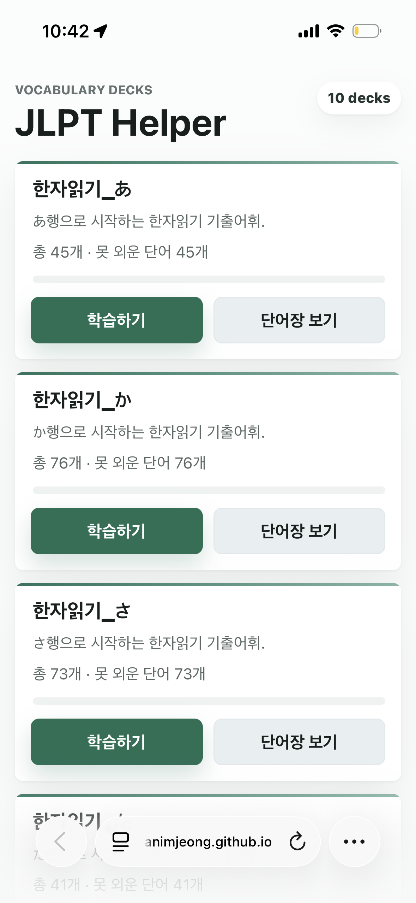
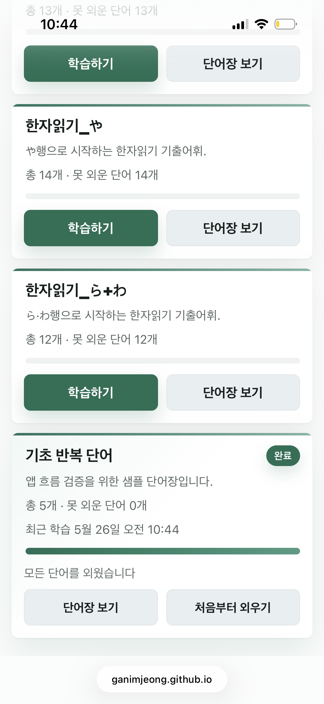
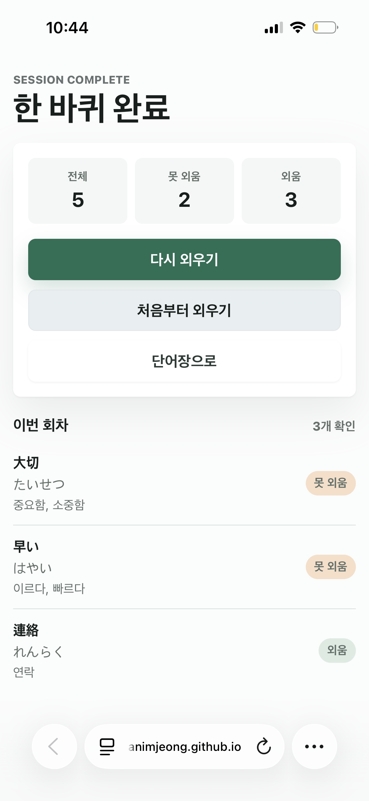
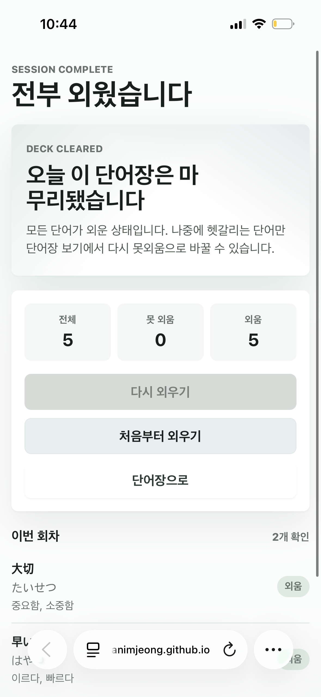
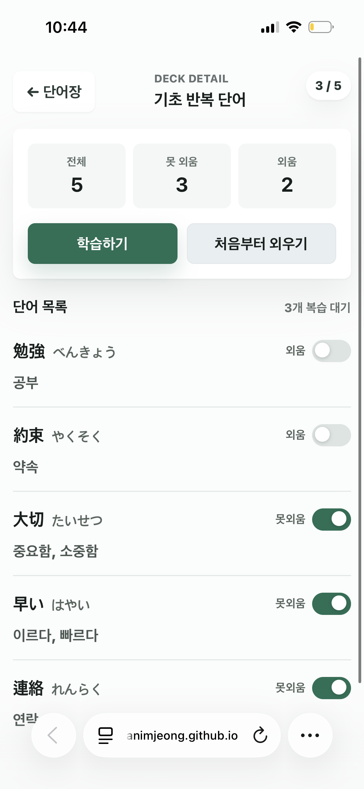

# JLPT Helper

모바일에서 일본어 단어를 한 장씩 넘기며 외우는 JLPT 단어장 웹앱입니다. 단어장은 코드에 영구 데이터로 저장하고, 각 브라우저의 학습 상태는 `localStorage`에 저장합니다.

배포 주소:

https://ganimjeong.github.io/jlpt-helper/

## Screenshots

| 단어장 목록 | 단어장 목록 (다 외운 경우) |
| --- | --- |
|  |  |

| 학습 카드 (1/4 단계) | 학습 카드 (4/4 단계) |
| --- | --- |
|  |  |

| 한 바퀴 완료 | 한 바퀴 완료 (다 외운 경우) |
| --- | --- |
|  |  |

| 단어장 보기 |
| --- |
|  |

## Features

- 모바일 우선 단어장 UI
- 단어장별 학습 진행 상태 표시
- 체크된 단어만 학습하는 반복 구조
- 카드 단계별 공개:
  1. 표기
  2. 읽기
  3. 일본어 예문
  4. 한국어 뜻과 예문 번역
- 버튼 또는 좌우 스와이프로 `외웠음` / `못외웠음` 선택
- 모든 단어를 외우면 완료 상태 표시
- 단어장 보기 화면에서 단어별 상태 수동 변경
- 브라우저 로컬 저장으로 새로고침 후에도 학습 상태 유지
- GitHub Pages 배포 workflow 포함

## Study Rules

- `checked`: 아직 못 외운 단어
- `unchecked`: 외운 단어
- 새 단어는 기본적으로 checked 상태입니다.
- 학습 세션에는 checked 단어만 나옵니다.
- 외운 단어는 다시 체크하거나 `처음부터 외우기`를 누르기 전까지 슬라이드에 나오지 않습니다.

## Tech Stack

- Vite
- React
- TypeScript
- Vitest
- GitHub Pages

## Getting Started

```bash
npm install
npm run dev
```

로컬 개발 서버가 뜨면 브라우저에서 안내된 URL을 엽니다.

## Scripts

```bash
npm run dev              # 로컬 개발 서버
npm run build            # 프로덕션 빌드
npm test                 # Vitest 테스트
npm run harness:smoke    # 하네스 기본 검증
npm run harness:report   # 프로젝트 상태 리포트
```

GitHub Pages용 경로로 빌드하려면:

```bash
npm run build -- --mode github-pages
```

## Adding Vocabulary

단어 데이터는 [src/data/decks.ts](src/data/decks.ts)에 있습니다.

기본 구조:

```ts
{
  id: "sample-basics-2026-05-17",
  title: "기초 반복 단어",
  description: "앱 흐름 검증을 위한 샘플 단어장입니다.",
  sourceBatch: "sample-2026-05-17",
  jlptLevel: "unknown",
  createdAt: "2026-05-17",
  updatedAt: "2026-05-17",
  words: [
    {
      id: "benkyou",
      kanji: "勉強",
      kana: "べんきょう",
      meaningKo: "공부",
      exampleJa: "毎日 日本語を 勉強します。",
      exampleKo: "매일 일본어를 공부합니다.",
      tags: ["noun", "suru-verb"]
    }
  ]
}
```

단어 작성 기준:

- `id`: 단어장 안에서 고유한 영문 slug
- `kanji`: 카드 첫 화면에 보일 대표 표기
- `kana`: 읽기. 한자가 없는 단어는 생략 가능
- `meaningKo`: 한국어 뜻
- `exampleJa`: 짧은 일본어 예문
- `exampleKo`: 예문 한국어 번역
- `tags`: 품사나 분류 태그

## Deployment

이 저장소는 GitHub Actions로 GitHub Pages에 배포합니다.

Workflow:

[.github/workflows/deploy-pages.yml](.github/workflows/deploy-pages.yml)

동작 방식:

1. `main` 브랜치에 push
2. `npm ci`
3. `npm run harness:smoke`
4. `npm test`
5. `npm run build -- --mode github-pages`
6. `dist/`를 GitHub Pages artifact로 배포

GitHub 저장소 설정에서 Pages source는 `GitHub Actions`로 둡니다.

## Project Notes

- 제품 기획은 [docs/PRODUCT_PLAN.md](docs/PRODUCT_PLAN.md)에 정리되어 있습니다.
- Codex 작업 규칙은 [AGENTS.md](AGENTS.md)와 `.ai/` 문서를 따릅니다.
- UI/모션/디자인 변경 전에는 [DESIGN.md](DESIGN.md)를 확인합니다.
